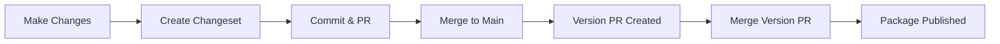

# Changesets

This directory manages versioning and changelogs for VisionAgent using [@changesets/cli](https://github.com/changesets/changesets).

## Table of Contents

- [Overview](#overview)
- [Workflow](#workflow)
- [Creating a Changeset](#creating-a-changeset)
- [Changeset Types](#changeset-types)
- [Writing Good Descriptions](#writing-good-descriptions)
- [Release Process](#release-process)
- [CI/CD Integration](#cicd-integration)
- [Troubleshooting](#troubleshooting)

---

## Overview

Changesets help us:

- Track what changes are included in each release
- Automatically determine version bumps (major/minor/patch)
- Generate human-readable changelogs
- Coordinate releases in CI/CD pipelines

---

## Workflow



### Detailed Flow

1. **Development**: Make your code changes
2. **Changeset**: Run `npx changeset` to describe changes
3. **Commit**: Commit the changeset file with your code
4. **Review**: PR is reviewed and merged
5. **Release**: Changesets bot creates a "Version Packages" PR
6. **Publish**: Merging the version PR triggers npm publish

---

## Creating a Changeset

### Interactive Mode (Recommended)

```bash
npx changeset
```

This will prompt you to:

1. Select the package(s) affected (for monorepos)
2. Choose the semver bump type
3. Write a description of the changes

### Quick Mode

```bash
# Patch release
npx changeset add --empty

# Then edit the generated file manually
```

### Output

A markdown file is created in `.changeset/`:

```
.changeset/
├── config.json
├── README.md
└── funny-pandas-dance.md  # <-- Generated changeset
```

---

## Changeset Types

Choose the appropriate version bump:

| Type | When to Use | Example |
|------|-------------|---------|
| **patch** | Bug fixes, documentation, internal changes | Fix typo in error message |
| **minor** | New features, non-breaking additions | Add streaming support |
| **major** | Breaking changes, API changes | Remove deprecated method |

### Examples

**Patch** (0.0.1 -> 0.0.2):

```markdown
---
"visionagent": patch
---

Fix image loading error when path contains spaces
```

**Minor** (0.0.1 -> 0.1.0):

```markdown
---
"visionagent": minor
---

Add support for streaming responses in agent loop
```

**Major** (0.0.1 -> 1.0.0):

```markdown
---
"visionagent": major
---

BREAKING: Rename `createModel` to `initializeModel`

Migration guide:
- Replace all `createModel()` calls with `initializeModel()`
- The API signature remains the same
```

---

## Writing Good Descriptions

### Do's

- **Be specific**: Describe what changed, not how you changed it
- **Be user-focused**: Explain the impact on users
- **Include context**: Link to issues or PRs when relevant
- **Document breaking changes**: Include migration steps

### Don'ts

- Don't use vague descriptions ("fix bug", "update code")
- Don't include implementation details unless relevant
- Don't skip the changeset for user-facing changes

### Good Examples

```markdown
---
"visionagent": minor
---

Add `onProgress` callback to `analyzeFigmaDesigns` for tracking analysis progress

Usage:
const result = await analyzeFigmaDesigns({
  model,
  source: './designs',
  onProgress: (current, total) => console.log(`${current}/${total}`)
});
```

```markdown
---
"visionagent": patch
---

Fix memory leak in agent loop when using many tools

The agent now properly cleans up tool execution contexts between iterations,
preventing memory accumulation during long-running agent sessions.
```

### Bad Examples

```markdown
---
"visionagent": patch
---

fix stuff
```

```markdown
---
"visionagent": minor
---

updated the code to use the new thing
```

---

## Release Process

### Manual Release

```bash
# 1. Consume all changesets and update versions
npx changeset version

# 2. Review the changes
git diff

# 3. Build the package
npm run build

# 4. Publish to npm
npm publish

# 5. Commit and push
git add .
git commit -m "chore: release visionagent@X.Y.Z"
git push
```

### Automated Release (CI/CD)

The release workflow in `.github/workflows/release.yml` handles this automatically:

1. When PRs with changesets are merged to `main`
2. The changeset bot creates a "Version Packages" PR
3. Merging that PR triggers the publish workflow

---

## CI/CD Integration

### GitHub Actions Setup

The project uses two workflows:

**CI Workflow** (`.github/workflows/ci.yml`):

- Runs on every PR
- Tests, lints, type-checks

**Release Workflow** (`.github/workflows/release.yml`):

- Triggered by the changeset bot
- Publishes to npm when version PR is merged

### Required Secrets

| Secret | Purpose |
|--------|---------|
| `NPM_TOKEN` | Publish to npm registry |
| `GITHUB_TOKEN` | Create releases (automatic) |

### Bot Behavior

The changeset bot will:

- Comment on PRs missing changesets (configurable)
- Create "Version Packages" PRs automatically
- Update the CHANGELOG.md file

---

## Troubleshooting

### "No changesets found" Warning

**Cause**: Your PR doesn't include a changeset file.

**Solution**: If your changes are user-facing, run `npx changeset` and commit the file.

**Note**: Some changes don't need changesets:

- Documentation-only changes (optional)
- Test-only changes
- CI/CD configuration
- Internal refactoring (if no API changes)

### "Changeset already consumed"

**Cause**: Running `npx changeset version` twice.

**Solution**: Changesets are deleted after versioning. This is expected behavior.

### Merge Conflicts in Changeset Files

**Cause**: Multiple PRs created changesets simultaneously.

**Solution**: Delete the conflicting changeset files and recreate:

```bash
# Remove conflicting changesets
rm .changeset/conflicting-file.md

# Create a new one
npx changeset
```

### Version PR Not Created

**Cause**: No changesets in main branch, or GitHub Actions disabled.

**Solution**:

1. Ensure changesets were merged to main
2. Check GitHub Actions are enabled
3. Verify the `release.yml` workflow exists

---

## Configuration

The `.changeset/config.json` file controls behavior:

```json
{
  "$schema": "https://unpkg.com/@changesets/config@3.0.0/schema.json",
  "changelog": "@changesets/cli/changelog",
  "commit": false,
  "access": "public",
  "baseBranch": "main"
}
```

| Option | Description |
|--------|-------------|
| `changelog` | Changelog generator to use |
| `commit` | Auto-commit version changes |
| `access` | npm publish access level |
| `baseBranch` | Branch for release comparisons |

---

## Resources

- [Changesets Documentation](https://github.com/changesets/changesets/blob/main/docs/intro-to-using-changesets.md)
- [Semantic Versioning](https://semver.org/)
- [Keep a Changelog](https://keepachangelog.com/)

---

<p align="center">
  <a href="../README.md">Back to Main README</a>
</p>
