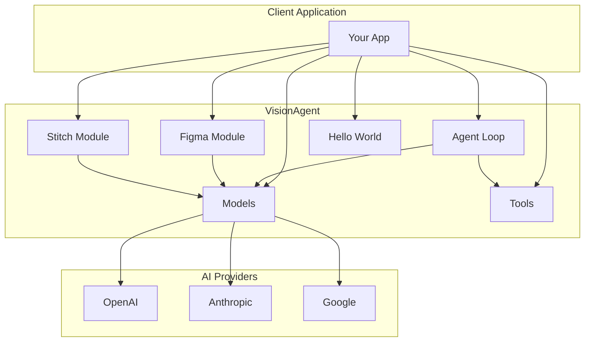
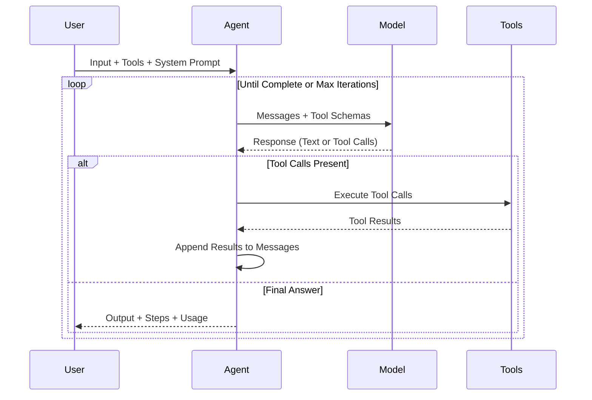

<p align="center">
  <h1 align="center">VisionAgent</h1>
  <p align="center">
    <strong>A powerful multi-provider AI agent framework with vision capabilities and tool calling.</strong>
  </p>
  <p align="center">
    Build intelligent agents that can process images, execute tools, and integrate seamlessly with AI ecosystems.
  </p>
</p>

<p align="center">
  <a href="https://www.npmjs.com/package/visionagent"></a>
  <a href="https://www.npmjs.com/package/visionagent"></a>
  <a href="https://www.typescriptlang.org/"></a>
  <a href="https://nodejs.org/"></a>
  <a href="https://github.com/sijeeshmiziha/visionagent/blob/main/LICENSE"></a>
  <a href="https://github.com/sijeeshmiziha/visionagent/pulls"></a>
</p>

<p align="center">
  <a href="#installation">Installation</a> •
  <a href="#quick-start">Quick Start</a> •
  <a href="#api-reference">API Reference</a> •
  <a href="#examples">Examples</a> •
  <a href="#faq">FAQ</a> •
  <a href="#contributing">Contributing</a>
</p>

---

## Table of Contents

- [Why VisionAgent?](#why-visionagent)
- [Features](#features)
- [Installation](#installation)
- [Quick Start](#quick-start)
- [Architecture](#architecture)
- [API Reference](#api-reference)
  - [Models](#models)
  - [Tools](#tools)
  - [Agents](#agents)
  - [Figma Module](#figma-module)
  - [Stitch Module](#stitch-module)
- [Module Exports](#module-exports)
- [Examples](#examples)
- [Comparison with Alternatives](#comparison-with-alternatives)
- [FAQ](#faq)
- [Troubleshooting](#troubleshooting)
- [Roadmap](#roadmap)
- [Contributing](#contributing)
- [Support](#support)
- [Sponsors](#sponsors)
- [License](#license)

---

## Why VisionAgent?

VisionAgent was built to solve a specific problem: **extracting actionable requirements from visual designs using AI**. While other frameworks focus on general-purpose AI orchestration, VisionAgent is optimized for:

- **Multi-Provider**: Unified API across OpenAI, Anthropic, and Google
- **Agent-First**: Tool calling, agents, and iteration control out of the box
- **Figma & Stitch**: Built-in Figma tools and Google Stitch integration
- **Type-Safe**: Full TypeScript support with Zod schema validation
- **Zero Extra Deps**: AI provider SDKs included; set API keys and go

```typescript
// Run an agent with tools in a few lines
import { createModel, runAgent, defineTool } from 'visionagent';
import { z } from 'zod';

const model = createModel({ provider: 'openai', model: 'gpt-4o-mini' });
const greetTool = defineTool({
  name: 'greet',
  description: 'Greet someone',
  input: z.object({ name: z.string() }),
  handler: async ({ name }) => ({ message: `Hello, ${name}!` }),
});

const result = await runAgent({
  model,
  tools: [greetTool],
  systemPrompt: 'You are a helpful assistant.',
  input: 'Greet Alice',
});
console.log(result.output);
```

---

## Features

| Feature             | Description                                                                                 |
| ------------------- | ------------------------------------------------------------------------------------------- |
| **Multi-Provider**  | Support for OpenAI (GPT-4o), Anthropic (Claude), and Google (Gemini)                        |
| **Tool System**     | Define custom tools with Zod schema validation and type inference                           |
| **Agent Framework** | Build autonomous agents with tool calling, reasoning, and iteration control                 |
| **Figma Module**    | 12 tools for Figma (screenshots, design context, variables, Code Connect, FigJam, diagrams) |
| **Stitch Module**   | 8 tools for Google Stitch (projects, screens, generate/edit/variants)                       |
| **Type-Safe**       | Full TypeScript support with comprehensive type definitions                                 |
| **Zero Config**     | Works out of the box with environment variables                                             |

---

## Installation

### Using npm

```bash
npm install visionagent
```

### Using yarn

```bash
yarn add visionagent
```

### Using pnpm

```bash
pnpm add visionagent
```

### Using bun

```bash
bun add visionagent
```

All AI provider SDKs (OpenAI, Anthropic, Google) are included as dependencies; no extra packages are required.

### Environment Setup

Create a `.env` file in your project root:

```bash
# Required: At least one AI provider API key
OPENAI_API_KEY=sk-...
ANTHROPIC_API_KEY=sk-ant-...
GOOGLE_GENERATIVE_AI_API_KEY=...

# Optional: For Figma examples and tools
FIGMA_API_KEY=figd_...
```

---

## Quick Start

### 1. Create a Model and Invoke

```typescript
import { createModel } from 'visionagent';

const model = createModel({
  provider: 'openai',
  model: 'gpt-4o-mini',
  temperature: 0.7,
});

const response = await model.invoke([
  { role: 'user', content: 'Explain TypeScript in one sentence.' },
]);
console.log(response.content);
```

### 2. Define Custom Tools

Create type-safe tools with Zod validation:

```typescript
import { defineTool } from 'visionagent';
import { z } from 'zod';

const calculatorTool = defineTool({
  name: 'calculator',
  description: 'Perform math calculations',
  input: z.object({
    expression: z.string().describe('Math expression to evaluate'),
  }),
  handler: async ({ expression }) => {
    const result = eval(expression); // Use a safe math parser in production
    return { result };
  },
});
```

### 3. Run an Agent

Build autonomous agents that use tools:

```typescript
import { runAgent, createModel, defineTool } from 'visionagent';
import { z } from 'zod';

const calculatorTool = defineTool({
  name: 'calculator',
  description: 'Perform math calculations',
  input: z.object({ expression: z.string() }),
  handler: async ({ expression }) => ({ result: String(eval(expression)) }),
});

const result = await runAgent({
  model: createModel({ provider: 'openai', model: 'gpt-4o-mini' }),
  tools: [calculatorTool],
  systemPrompt: 'You are a helpful assistant. Use the calculator when needed.',
  input: 'What is 25 multiplied by 4?',
  maxIterations: 10,
  onStep: step => console.log(`Step ${step.iteration}:`, step.action),
});

console.log(result.output);
```

### 4. Use the Figma Module

Run the Figma agent or use individual tools (screenshots, design context, variables, Code Connect, etc.):

```typescript
import { runFigmaAgent, createFigmaToolSet, createModel } from 'visionagent';

const model = createModel({ provider: 'openai', model: 'gpt-4o-mini' });
const figmaTools = createFigmaToolSet();

const result = await runFigmaAgent({
  model,
  tools: figmaTools,
  systemPrompt: 'You help with Figma design tasks.',
  input: 'Get a screenshot of the node at https://figma.com/design/...',
  maxIterations: 5,
});
console.log(result.output);
```

### 5. Use the Stitch Module

Create projects and generate or edit screens with Google Stitch:

```typescript
import { runStitchAgent, createStitchToolSet, createModel } from 'visionagent';

const model = createModel({ provider: 'openai', model: 'gpt-4o-mini' });
const stitchTools = createStitchToolSet();

const result = await runStitchAgent({
  model,
  tools: stitchTools,
  systemPrompt: 'You help with Stitch UI generation.',
  input: 'Create a project called "My App" and generate a login screen.',
  maxIterations: 10,
});
```

---

## Architecture



### Agent Execution Flow



---

## API Reference

### Models

Create and configure AI models. All imports are from the main package:

```typescript
import { createModel } from 'visionagent';

const model = createModel({
  provider: 'openai' | 'anthropic' | 'google',
  model: string,           // e.g., 'gpt-4o', 'gpt-4o-mini', 'claude-3-5-sonnet-20241022'
  apiKey?: string,         // Uses env var by default (OPENAI_API_KEY, etc.)
  temperature?: number,    // 0-2, default varies by provider
  maxTokens?: number,      // Max tokens in response
});

// Invoke with messages (and optional tools for agent use)
const response = await model.invoke(messages, { tools });
```

#### Supported Models

| Provider  | Models                                                 | Vision Support |
| --------- | ------------------------------------------------------ | -------------- |
| OpenAI    | `gpt-4o`, `gpt-4o-mini`, `gpt-4-turbo`                 | Yes            |
| Anthropic | `claude-3-5-sonnet-20241022`, `claude-3-opus-20240229` | Yes            |
| Google    | `gemini-1.5-pro`, `gemini-1.5-flash`                   | Yes            |

### Tools

Define type-safe tools with Zod; the agent uses them via `createToolSet`:

```typescript
import { defineTool, createToolSet, getTool } from 'visionagent';
import { z } from 'zod';

const calculatorTool = defineTool({
  name: 'calculator',
  description: 'Perform mathematical calculations',
  input: z.object({
    expression: z.string().describe('Math expression to evaluate'),
  }),
  handler: async ({ expression }) => {
    const result = eval(expression); // Use a safe math parser in production
    return { result };
  },
});

// Create a tool set for the agent
const tools = createToolSet({ calculator: calculatorTool, search: searchTool });

// Retrieve a specific tool by name
const tool = getTool(tools, 'calculator');
```

### Agents

Run autonomous agents with tool calling:

```typescript
import { runAgent } from 'visionagent';

const result = await runAgent({
  model,                    // Created with createModel()
  tools,                    // Array of tools or ToolSet
  systemPrompt: string,     // Instructions for the agent
  input: string,            // User's request
  maxIterations?: number,   // Default: 10
  onStep?: (step) => void,  // Callback for each step
});

// Result structure
interface AgentResult {
  output: string;           // Final answer from the agent
  steps: AgentStep[];       // Array of steps with tool calls
  messages: Message[];      // Full conversation history
  totalUsage: TokenUsage;   // Total tokens used
}
```

### Figma Module

The Figma module provides an agent and 12 tools for Figma integration (screenshots, design context, metadata, variables, Code Connect, FigJam, diagrams). Use with `FIGMA_API_KEY` set.

```typescript
import {
  runFigmaAgent,
  createFigmaToolSet,
  figmaGetScreenshotTool,
  figmaGetDesignContextTool,
  FigmaClient,
  parseFigmaUrl,
} from 'visionagent';

// Run the Figma agent with all tools
const figmaTools = createFigmaToolSet();
const result = await runFigmaAgent({
  model: createModel({ provider: 'openai', model: 'gpt-4o-mini' }),
  tools: figmaTools,
  systemPrompt: 'You help with Figma design tasks.',
  input: 'Get a screenshot of the design at <url>',
  maxIterations: 5,
});

// Or use individual tools in your own agent
const tools = createToolSet({
  screenshot: figmaGetScreenshotTool,
  designContext: figmaGetDesignContextTool,
});

// Low-level: FigmaClient for direct API access
const client = new FigmaClient({ apiKey: process.env.FIGMA_API_KEY });
const image = await client.getScreenshot(fileKey, nodeId, { format: 'png' });
```

**Figma tools:** `figmaWhoamiTool`, `figmaGetScreenshotTool`, `figmaGetDesignContextTool`, `figmaGetMetadataTool`, `figmaGetVariableDefsTool`, `figmaGetCodeConnectMapTool`, `figmaAddCodeConnectMapTool`, `figmaGetCodeConnectSuggestionsTool`, `figmaSendCodeConnectMappingsTool`, `figmaCreateDesignSystemRulesTool`, `figmaGetFigjamTool`, `figmaGenerateDiagramTool`.

### Stitch Module

The Stitch module provides an agent and 8 tools for [Google Stitch](https://stitch.withgoogle.com/docs/mcp/setup) (projects, screens, generate/edit/variants).

```typescript
import {
  runStitchAgent,
  createStitchToolSet,
  stitchCreateProjectTool,
  stitchGenerateScreenTool,
  StitchClient,
} from 'visionagent';

// Run the Stitch agent with all tools
const stitchTools = createStitchToolSet();
const result = await runStitchAgent({
  model: createModel({ provider: 'openai', model: 'gpt-4o-mini' }),
  tools: stitchTools,
  systemPrompt: 'You help with UI generation using Stitch.',
  input: 'Create a project "My App" and generate a login screen.',
  maxIterations: 10,
});

// Or use individual tools
const tools = createToolSet({
  createProject: stitchCreateProjectTool,
  generateScreen: stitchGenerateScreenTool,
});
```

**Stitch tools:** `stitchCreateProjectTool`, `stitchGetProjectTool`, `stitchListProjectsTool`, `stitchListScreensTool`, `stitchGetScreenTool`, `stitchGenerateScreenTool`, `stitchEditScreensTool`, `stitchGenerateVariantsTool`.

---

## Module Exports

VisionAgent uses a single entry point. Import everything from `visionagent`:

```typescript
import {
  createModel,
  runAgent,
  defineTool,
  createToolSet,
  runFigmaAgent,
  createFigmaToolSet,
  runStitchAgent,
  createStitchToolSet,
  runHelloWorldAgent,
  helloWorldTool,
} from 'visionagent';
```

---

## Examples

See the [examples directory](./examples/README.md) for runnable examples. Use the interactive launcher or run a specific file:

```bash
# Interactive launcher (pick example and provide inputs)
npm run example:interactive

# Run a specific example
npm run example -- examples/core/01-basic-model.ts
npm run example -- examples/figma/02-get-screenshot.ts
npm run example -- examples/stitch/06-generate-screen.ts
```

| Group           | Examples                                                               | Description                                                           |
| --------------- | ---------------------------------------------------------------------- | --------------------------------------------------------------------- |
| **Core**        | 01 Basic Model, 02 All Providers, 03 Tool Calling, 04 Multi-Tool Agent | Models, agents, tools                                                 |
| **Figma**       | 01 Whoami through 12 Generate Diagram                                  | Figma tools (screenshots, design context, Code Connect, FigJam, etc.) |
| **Hello World** | 01 Hello World                                                         | Minimal agent with greeting tool                                      |
| **Stitch**      | 01 Create Project through 08 Generate Variants                         | Google Stitch (projects, screens, generate/edit/variants)             |

---

## Comparison with Alternatives

| Feature               | VisionAgent             | LangChain                 | LlamaIndex | AutoGPT           |
| --------------------- | ----------------------- | ------------------------- | ---------- | ----------------- |
| **Focus**             | Agents + Figma + Stitch | General LLM Orchestration | Data/RAG   | Autonomous Agents |
| **TypeScript**        | First-class             | Good                      | Good       | Python Only       |
| **Learning Curve**    | Low                     | High                      | Medium     | High              |
| **Figma Integration** | Built-in (12 tools)     | Manual                    | Manual     | Manual            |
| **Google Stitch**     | Built-in (8 tools)      | Manual                    | Manual     | Manual            |

### When to Use VisionAgent

- You want agents with tool calling (OpenAI, Anthropic, Google)
- You need Figma integration (screenshots, design context, Code Connect, FigJam)
- You use Google Stitch for UI generation
- You're building TypeScript/Node.js applications with a simple, focused API

### When to Consider Alternatives

- **LangChain**: Complex chains, extensive integrations, Python ecosystem
- **LlamaIndex**: Heavy RAG workloads, document indexing
- **AutoGPT**: Fully autonomous long-running tasks

---

## FAQ

### Which AI provider should I use?

**For vision tasks**: OpenAI GPT-4o offers the best balance of quality and speed. Claude 3.5 Sonnet is excellent for detailed analysis. Gemini 1.5 Pro is cost-effective for high-volume processing.

**For general agents**: All providers work well. Choose based on your existing infrastructure and pricing preferences.

### How do I handle rate limits?

VisionAgent doesn't include built-in rate limiting. Use a retry library (e.g. `p-retry`) around model or agent calls if your provider rate-limits requests.

### What image formats are supported?

- **Supported**: PNG, JPEG, WebP, GIF (first frame)
- **Recommended**: PNG for UI screenshots (lossless)
- **Max size**: Varies by provider (typically 20MB)

### How do I optimize token usage?

1. Use `detail: 'low'` for simple images
2. Resize large images before analysis
3. Batch related images together
4. Use specific prompts to focus analysis

### Can I use VisionAgent in the browser?

VisionAgent is designed for Node.js environments. For browser usage, you'll need to proxy API calls through your backend for security.

---

## Troubleshooting

### API Key Issues

**Error**: `Invalid API key` or `Authentication failed`

```bash
# Verify your API key is set
echo $OPENAI_API_KEY

# Check .env file is being loaded (use --env-file with tsx/node)
node -e "require('dotenv').config(); console.log(process.env.OPENAI_API_KEY)"
```

For Figma examples, ensure `FIGMA_API_KEY` is set (personal access token from Figma).

### Image Loading Errors

**Error**: `Failed to load image` or `Invalid image format`

```typescript
// Verify the image exists and is readable
import { existsSync } from 'fs';
console.log(existsSync('./image.png')); // Should be true

// Check supported formats
const supported = ['.png', '.jpg', '.jpeg', '.webp', '.gif'];
```

### Model Not Available

**Error**: `Model not found` or `Invalid model`

```typescript
// Verify model name matches provider's naming
const validModels = {
  openai: ['gpt-4o', 'gpt-4o-mini', 'gpt-4-turbo'],
  anthropic: ['claude-3-5-sonnet-20241022', 'claude-3-opus-20240229'],
  google: ['gemini-1.5-pro', 'gemini-1.5-flash'],
};
```

### Memory Issues with Large Payloads

For long agent runs or many tools, process in smaller batches or limit `maxIterations`. For Figma screenshots, request one node at a time if memory is constrained.

---

## Roadmap

### Completed (v0.0.1)

- [x] Multi-provider model abstraction
- [x] Vision analysis capabilities
- [x] Tool definition with Zod schemas
- [x] Agent loop with tool calling
- [x] Figma module (12 tools, agent)
- [x] Stitch module (8 tools, agent)

### Short Term (v0.1.x)

- [ ] Streaming responses support
- [ ] Built-in rate limiting and retries
- [ ] Conversation memory/history
- [ ] More vision analysis templates
- [ ] Enhanced error messages

### Medium Term (v0.2.x - v0.5.x)

- [ ] Web UI for Figma analysis
- [ ] Agent workflows and chains
- [ ] Built-in caching layer
- [ ] Ollama/local model support

### Long Term (v1.0+)

- [ ] Visual agent builder
- [ ] Plugin ecosystem
- [ ] Cloud-hosted analysis service
- [ ] Multi-modal outputs (not just text)

### Community Contributions Welcome

We especially welcome contributions for:

- Additional AI provider integrations
- New tool templates
- Documentation improvements
- Example applications
- Bug fixes and tests

---

## Contributing

We welcome contributions! Please see our [Contributing Guide](CONTRIBUTING.md) for details.

**Contributors** – thank you to everyone who has contributed to VisionAgent:

<p align="center">
  <a href="https://github.com/sijeeshmiziha/visionagent/graphs/contributors">
    
  </a>
</p>

### Quick Start for Contributors

```bash
# Clone the repository
git clone https://github.com/sijeeshmiziha/visionagent.git
cd visionagent

# Install dependencies
npm install

# Run tests
npm test

# Run linting
npm run lint

# Build the project
npm run build
```

### Development Commands

| Command                    | Description                |
| -------------------------- | -------------------------- |
| `npm run dev`              | Watch mode for development |
| `npm test`                 | Run unit tests             |
| `npm run test:integration` | Run integration tests      |
| `npm run lint`             | Check code style           |
| `npm run lint:fix`         | Auto-fix code style        |
| `npm run typecheck`        | TypeScript type checking   |
| `npm run build`            | Production build           |

---

## Support

### Get Help

- [GitHub Issues](https://github.com/sijeeshmiziha/visionagent/issues) - Bug reports and feature requests
- [GitHub Discussions](https://github.com/sijeeshmiziha/visionagent/discussions) - Questions and community help

### Stay Updated

- [Star the repo](https://github.com/sijeeshmiziha/visionagent) to get notified of releases
- [Star History](https://star-history.com/#sijeeshmiziha/visionagent&Date) – view star growth over time
- Watch the repo for updates on new features

### Sponsorship

If VisionAgent helps your business, consider supporting development:

- [GitHub Sponsors](https://github.com/sponsors/sijeeshmiziha)

---

## Sponsors

Support VisionAgent by becoming a [sponsor](https://github.com/sponsors/sijeeshmiziha). Your logo will appear here with a link to your site.

---

## License

MIT License - see [LICENSE](LICENSE) for details.

---

<p align="center">
  Made with ❤️ by the CompilersLab team!
</p>
