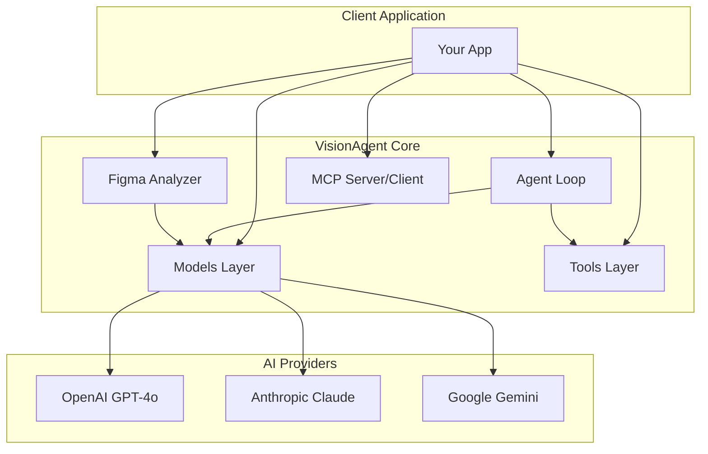
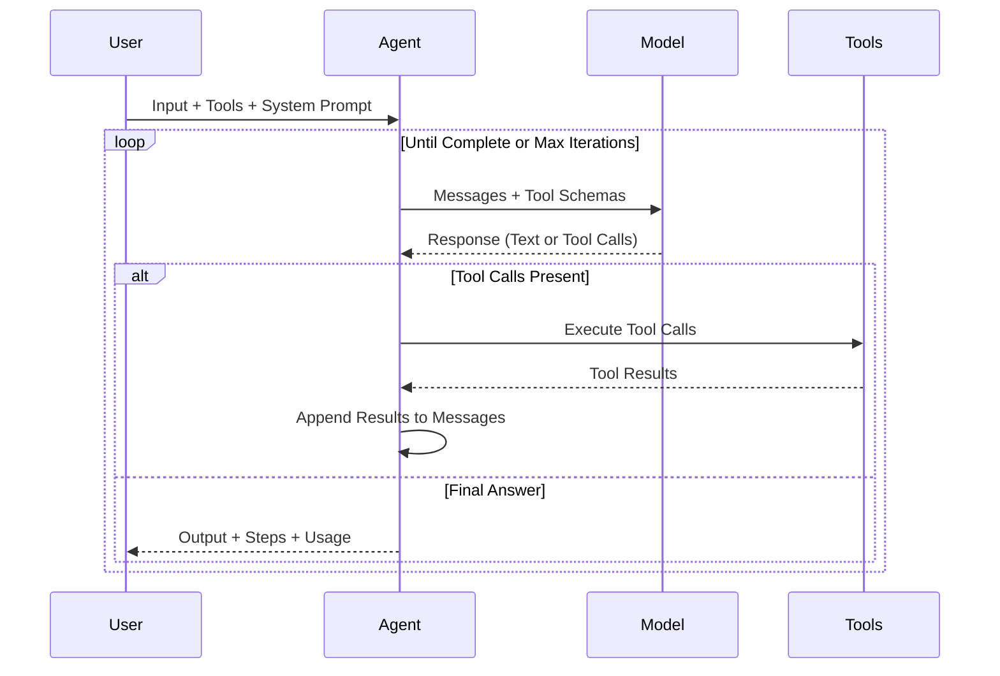

<p align="center">
  <h1 align="center">VisionAgent</h1>
  <p align="center">
    <strong>A powerful multi-provider AI agent framework with vision capabilities, tool calling, and MCP support.</strong>
  </p>
  <p align="center">
    Build intelligent agents that can process images, execute tools, and integrate seamlessly with AI ecosystems.
  </p>
</p>

<p align="center">
  <a href="https://www.npmjs.com/package/visionagent"></a>
  <a href="https://github.com/sijeeshmiziha/visionagent/actions/workflows/ci.yml"></a>
  <a href="https://www.npmjs.com/package/visionagent"></a>
  <a href="https://github.com/sijeeshmiziha/visionagent/blob/main/LICENSE"></a>
  <a href="https://www.typescriptlang.org/"></a>
  <a href="https://nodejs.org/"></a>
</p>

<p align="center">
  <a href="#installation">Installation</a> •
  <a href="#quick-start">Quick Start</a> •
  <a href="#api-reference">API Reference</a> •
  <a href="#examples">Examples</a> •
  <a href="#faq">FAQ</a> •
  <a href="#contributing">Contributing</a>
</p>

---

## Table of Contents

- [Why VisionAgent?](#why-visionagent)
- [Features](#features)
- [Installation](#installation)
- [Quick Start](#quick-start)
- [Architecture](#architecture)
- [API Reference](#api-reference)
  - [Models](#models)
  - [Tools](#tools)
  - [Agents](#agents)
  - [Figma Analysis](#figma-analysis)
  - [MCP Integration](#mcp-integration)
- [Module Exports](#module-exports)
- [Examples](#examples)
- [Comparison with Alternatives](#comparison-with-alternatives)
- [FAQ](#faq)
- [Troubleshooting](#troubleshooting)
- [Roadmap](#roadmap)
- [Contributing](#contributing)
- [Support](#support)
- [License](#license)

---

## Why VisionAgent?

VisionAgent was built to solve a specific problem: **extracting actionable requirements from visual designs using AI**. While other frameworks focus on general-purpose AI orchestration, VisionAgent is optimized for:

- **Vision-First Design**: Native support for image analysis across all major AI providers
- **Lightweight & Focused**: ~15KB minified, no bloated dependencies
- **Tree-Shakeable**: Import only what you need for optimal bundle sizes
- **Type-Safe**: Full TypeScript support with Zod schema validation
- **MCP Native**: First-class Model Context Protocol support for tool interoperability

```typescript
// Turn Figma designs into requirements in 5 lines
import { createModel, analyzeFigmaDesigns } from 'visionagent';

const model = createModel({ provider: 'openai', model: 'gpt-4o' });
const { analysis } = await analyzeFigmaDesigns({ model, source: './designs' });
console.log(analysis); // User stories, features, acceptance criteria
```

---

## Features

| Feature             | Description                                                                 |
| ------------------- | --------------------------------------------------------------------------- |
| **Vision Analysis** | Process images with AI vision models (Figma designs, screenshots, diagrams) |
| **Multi-Provider**  | Support for OpenAI (GPT-4o), Anthropic (Claude), and Google (Gemini)        |
| **Tool System**     | Define custom tools with Zod schema validation and type inference           |
| **Agent Framework** | Build autonomous agents with tool calling, reasoning, and iteration control |
| **MCP Integration** | Create and consume Model Context Protocol servers for tool interoperability |
| **Tree-Shakeable**  | Modular exports for optimized bundle sizes                                  |
| **Type-Safe**       | Full TypeScript support with comprehensive type definitions                 |
| **Zero Config**     | Works out of the box with environment variables                             |

---

## Installation

### Using npm

```bash
npm install visionagent
```

### Using yarn

```bash
yarn add visionagent
```

### Using pnpm

```bash
pnpm add visionagent
```

### Using bun

```bash
bun add visionagent
```

### Provider Dependencies

Install the AI provider(s) you want to use:

```bash
# OpenAI (GPT-4o, GPT-4 Turbo) - Recommended for vision
npm install @langchain/openai

# Anthropic (Claude 3.5 Sonnet, Claude 3 Opus)
npm install @langchain/anthropic

# Google (Gemini 1.5 Pro, Gemini 1.5 Flash)
npm install @langchain/google-genai

# MCP Server Support (optional)
npm install @modelcontextprotocol/sdk
```

### Environment Setup

Create a `.env` file in your project root:

```bash
# Required: At least one provider API key
OPENAI_API_KEY=sk-...
ANTHROPIC_API_KEY=sk-ant-...
GOOGLE_GENERATIVE_AI_API_KEY=...
```

---

## Quick Start

### 1. Analyze Figma Designs

Extract user stories and requirements from design screenshots:

```typescript
import { createModel, analyzeFigmaDesigns } from 'visionagent';

// Create a vision-capable model
const model = createModel({
  provider: 'openai',
  model: 'gpt-4o',
  temperature: 0.3,
});

// Analyze designs from a folder
const result = await analyzeFigmaDesigns({
  model,
  source: '/path/to/figma/exports',
  detail: 'high',
});

console.log(result.analysis);
// Output: Markdown with User Types, User Stories, Features, Acceptance Criteria
```

### 2. Analyze Figma Designs for Code Generation (NEW)

Get structured JSON output perfect for code generation tools:

```typescript
import { analyzeFigmaForCode } from 'visionagent';

// Comprehensive analysis with structured output
const result = await analyzeFigmaForCode({
  apiKey: process.env.OPENAI_API_KEY,
  provider: 'openai',
  images: ['./screens/login.png', './screens/dashboard.png'],
});

// Screens identified
console.log(result.screens);
// [{ screenName: 'Login Screen', screenType: 'Authentication', ... }]

// UI components extracted
console.log(result.components);
// [{ screenName: 'Login Screen', components: [{ name: 'LoginButton', type: 'Button', props: [...] }] }]

// API endpoints generated
console.log(result.apiEndpoints);
// { endpoints: [{ method: 'POST', path: '/api/auth/login', ... }] }

// Requirements (markdown)
console.log(result.requirements);
```

Or use individual functions for more control:

```typescript
import { identifyScreens, extractComponents, generateAPIEndpoints } from 'visionagent';

// Just get screens
const screens = await identifyScreens({
  apiKey: process.env.OPENAI_API_KEY,
  provider: 'openai',
  images: './screens',
});

// Just get components
const components = await extractComponents({
  apiKey: process.env.OPENAI_API_KEY,
  provider: 'openai',
  model: 'gpt-4o-mini', // Optional: use specific model
  images: './screens',
});

// Just get API endpoints
const endpoints = await generateAPIEndpoints({
  apiKey: process.env.OPENAI_API_KEY,
  provider: 'anthropic', // Supports all providers
  images: './screens',
});
```

### 3. Define Custom Tools

Create type-safe tools with Zod validation:

```typescript
import { defineTool } from 'visionagent/tools';
import { z } from 'zod';

const searchTool = defineTool({
  name: 'web_search',
  description: 'Search the web for information',
  input: z.object({
    query: z.string().describe('The search query'),
    limit: z.number().optional().default(10),
  }),
  handler: async ({ query, limit }) => {
    // Your implementation
    const results = await performSearch(query, limit);
    return { results };
  },
});
```

### 4. Run an Agent

Build autonomous agents that can use tools:

```typescript
import { runAgent, createModel, defineTool } from 'visionagent';

const result = await runAgent({
  model: createModel({ provider: 'openai', model: 'gpt-4o' }),
  tools: [searchTool, writeFileTool],
  systemPrompt: 'You are a helpful research assistant.',
  input: 'Search for React best practices and summarize the top 5',
  maxIterations: 10,
  onStep: step => console.log(`Step ${step.iteration}:`, step.action),
});

console.log(result.output);
console.log(`Completed in ${result.steps.length} steps`);
```

### 5. Create an MCP Server

Expose your tools via Model Context Protocol:

```typescript
import { createMCPServer, defineTool } from 'visionagent';

const server = createMCPServer({
  name: 'my-tools',
  version: '1.0.0',
  tools: [searchTool, analysisTool],
});

// Start with stdio transport (for Cursor, Claude Desktop, etc.)
await server.start('stdio');
```

---

## Architecture



### Agent Execution Flow



---

## API Reference

### Models

Create and configure AI models:

```typescript
import { createModel } from 'visionagent/models';

const model = createModel({
  provider: 'openai' | 'anthropic' | 'google',
  model: string,           // e.g., 'gpt-4o', 'claude-3-5-sonnet-20241022'
  apiKey?: string,         // Uses env var by default (OPENAI_API_KEY, etc.)
  temperature?: number,    // 0-2, default varies by provider
  maxTokens?: number,      // Max tokens in response
});

// Standard invocation
const response = await model.invoke(messages, { tools });

// Vision-specific invocation
const visionResponse = await model.generateVision(prompt, images, {
  detail: 'high' | 'low' | 'auto',
});
```

#### Supported Models

| Provider  | Models                                                 | Vision Support |
| --------- | ------------------------------------------------------ | -------------- |
| OpenAI    | `gpt-4o`, `gpt-4o-mini`, `gpt-4-turbo`                 | Yes            |
| Anthropic | `claude-3-5-sonnet-20241022`, `claude-3-opus-20240229` | Yes            |
| Google    | `gemini-1.5-pro`, `gemini-1.5-flash`                   | Yes            |

### Tools

Define type-safe tools with automatic schema generation:

```typescript
import { defineTool, createToolSet, getToolSchemas, getTool } from 'visionagent/tools';
import { z } from 'zod';

// Define a tool
const calculatorTool = defineTool({
  name: 'calculator',
  description: 'Perform mathematical calculations',
  input: z.object({
    expression: z.string().describe('Math expression to evaluate'),
  }),
  handler: async ({ expression }) => {
    const result = eval(expression); // Use a safe math parser in production
    return { result };
  },
});

// Create a tool set for the agent
const tools = createToolSet({ calculator: calculatorTool, search: searchTool });

// Get schemas for LLM (OpenAI function calling format)
const schemas = getToolSchemas(tools);

// Retrieve a specific tool
const tool = getTool(tools, 'calculator');
```

### Agents

Run autonomous agents with tool calling:

```typescript
import { runAgent } from 'visionagent/agents';

const result = await runAgent({
  model,                    // Created with createModel()
  tools,                    // Array of tools or ToolSet
  systemPrompt: string,     // Instructions for the agent
  input: string,            // User's request
  maxIterations?: number,   // Default: 10
  onStep?: (step) => void,  // Callback for each step
});

// Result structure
interface AgentResult {
  output: string;           // Final answer from the agent
  steps: AgentStep[];       // Array of steps with tool calls
  messages: Message[];      // Full conversation history
  totalUsage: TokenUsage;   // Total tokens used
}
```

### Figma Analysis

#### Traditional Analysis (Markdown Output)

Extract requirements in markdown format:

```typescript
import { analyzeFigmaDesigns, validateFigmaFolder } from 'visionagent/figma';

// Analyze from a folder
const result = await analyzeFigmaDesigns({
  model,
  source: '/path/to/designs',  // Folder path
  maxImages?: 20,              // Limit number of images
  detail?: 'high' | 'low',     // Vision detail level
});

// Result structure
interface FigmaAnalysisResult {
  analysis: string;         // Markdown with requirements
  imageCount: number;       // Number of images processed
  imagePaths: string[];     // Paths to analyzed images
}
```

#### Code-Oriented Analysis (Structured JSON Output)

Get structured data for code generation:

```typescript
import {
  analyzeFigmaForCode,
  identifyScreens,
  extractComponents,
  generateAPIEndpoints,
} from 'visionagent';

// All-in-one analysis
const result = await analyzeFigmaForCode({
  apiKey: string,                          // Required: API key
  provider: 'openai' | 'anthropic' | 'google',  // Required: Provider
  model?: string,                          // Optional: Defaults to best model per provider
  images: string | string[],               // Folder path or array of file paths
  maxImages?: number,                      // Default: 20
  detail?: 'low' | 'high' | 'auto',       // Default: 'high'
});

// Result structure
interface CodeAnalysisResult {
  screens: ScreenIdentification[];       // Identified screens
  components: ComponentExtraction[];     // UI components
  apiEndpoints: APIEndpointList;        // API specifications
  requirements: string;                  // Markdown requirements
}

// Individual functions for more control
const screens = await identifyScreens({ apiKey, provider, images });
const components = await extractComponents({ apiKey, provider, images });
const endpoints = await generateAPIEndpoints({ apiKey, provider, images });
```

**Default Models per Provider:**

- `openai`: `gpt-4o`
- `anthropic`: `claude-3-5-sonnet-20241022`
- `google`: `gemini-1.5-pro`

**Output Types:**

```typescript
interface ScreenIdentification {
  screenName: string; // e.g., "Login Screen"
  screenType: string; // e.g., "Authentication"
  description: string;
  purpose: string;
  userType: string; // e.g., "Guest", "Admin"
  imagePath: string;
}

interface ComponentExtraction {
  screenName: string;
  components: Component[];
  imagePath: string;
}

interface Component {
  name: string; // e.g., "LoginButton"
  type: string; // e.g., "Button", "TextInput"
  props: string[]; // e.g., ["label", "onClick"]
  description: string;
}

interface APIEndpoint {
  method: 'GET' | 'POST' | 'PUT' | 'DELETE' | 'PATCH';
  path: string; // e.g., "/api/auth/login"
  description: string;
  requestBody?: object;
  responseBody?: object;
  authentication: boolean;
  relatedScreen: string;
}
```

### MCP Integration

Create MCP servers and clients:

```typescript
import { createMCPServer, createMCPClient } from 'visionagent/mcp';

// Create an MCP server
const server = createMCPServer({
  name: 'my-tools',
  version: '1.0.0',
  tools: [searchTool, analysisTool],
});

await server.start('stdio'); // For CLI tools, Cursor, Claude Desktop
await server.stop();

// Create an MCP client
const client = createMCPClient({
  transport: 'stdio',
  command: 'npx',
  args: ['-y', '@modelcontextprotocol/server-filesystem'],
});

await client.connect();
const tools = await client.getTools(); // Get available tools
const result = await client.callTool('read_file', { path: '/tmp/test.txt' });
await client.disconnect();
```

---

## Module Exports

VisionAgent provides multiple entry points for optimal tree-shaking:

```typescript
// Main entry - exports everything
import { createModel, analyzeFigmaDesigns, runAgent } from 'visionagent';

// Specific modules - smaller bundle size
import { analyzeFigmaDesigns, validateFigmaFolder } from 'visionagent/figma';
import { createModel } from 'visionagent/models';
import { defineTool, createToolSet } from 'visionagent/tools';
import { runAgent } from 'visionagent/agents';
import { createMCPServer, createMCPClient } from 'visionagent/mcp';
```

---

## Examples

See the [examples directory](./examples/README.md) for runnable examples:

| Example          | Command              | Description                      |
| ---------------- | -------------------- | -------------------------------- |
| Basic Model      | `npm run example:01` | Simple model invocation          |
| All Providers    | `npm run example:02` | Test OpenAI, Anthropic, Google   |
| Tool Calling     | `npm run example:03` | Agent with calculator tool       |
| Multi-Tool Agent | `npm run example:04` | Complex multi-tool orchestration |
| MCP Server       | `npm run example:05` | Create an MCP server             |
| Hello World      | `npm run example:06` | Basic agent with greeting tool   |
| Hello World MCP  | `npm run example:07` | MCP server with hello-world tool |

---

## Comparison with Alternatives

| Feature            | VisionAgent     | LangChain                 | LlamaIndex  | AutoGPT           |
| ------------------ | --------------- | ------------------------- | ----------- | ----------------- |
| **Focus**          | Vision + Agents | General LLM Orchestration | Data/RAG    | Autonomous Agents |
| **Bundle Size**    | ~15KB           | ~500KB+                   | ~200KB+     | N/A (Python)      |
| **Tree-Shaking**   | Yes             | Partial                   | Partial     | No                |
| **Vision Native**  | Yes             | Via Plugins               | Via Plugins | Limited           |
| **MCP Support**    | Native          | No                        | No          | No                |
| **TypeScript**     | First-class     | Good                      | Good        | Python Only       |
| **Learning Curve** | Low             | High                      | Medium      | High              |
| **Figma Analysis** | Built-in        | Manual                    | Manual      | Manual            |

### When to Use VisionAgent

- You need to analyze visual designs (Figma, screenshots)
- You want a lightweight, tree-shakeable library
- You're building TypeScript/Node.js applications
- You need MCP server/client support
- You want simple, focused APIs without complexity

### When to Consider Alternatives

- **LangChain**: Complex chains, extensive integrations, Python ecosystem
- **LlamaIndex**: Heavy RAG workloads, document indexing
- **AutoGPT**: Fully autonomous long-running tasks

---

## FAQ

### Which AI provider should I use?

**For vision tasks**: OpenAI GPT-4o offers the best balance of quality and speed. Claude 3.5 Sonnet is excellent for detailed analysis. Gemini 1.5 Pro is cost-effective for high-volume processing.

**For general agents**: All providers work well. Choose based on your existing infrastructure and pricing preferences.

### How do I handle rate limits?

VisionAgent doesn't include built-in rate limiting. We recommend:

```typescript
import pRetry from 'p-retry';

const result = await pRetry(() => analyzeFigmaDesigns({ model, source: './designs' }), {
  retries: 3,
  minTimeout: 1000,
});
```

### What image formats are supported?

- **Supported**: PNG, JPEG, WebP, GIF (first frame)
- **Recommended**: PNG for UI screenshots (lossless)
- **Max size**: Varies by provider (typically 20MB)

### How do I optimize token usage?

1. Use `detail: 'low'` for simple images
2. Resize large images before analysis
3. Batch related images together
4. Use specific prompts to focus analysis

### Can I use VisionAgent in the browser?

VisionAgent is designed for Node.js environments. For browser usage, you'll need to proxy API calls through your backend for security.

### How do I deploy an MCP server?

```bash
# As a CLI tool
npx visionagent-server

# In a Docker container
docker run -it visionagent-server

# With Claude Desktop (add to config)
{
  "mcpServers": {
    "visionagent": {
      "command": "npx",
      "args": ["-y", "visionagent-server"]
    }
  }
}
```

---

## Troubleshooting

### API Key Issues

**Error**: `Invalid API key` or `Authentication failed`

```bash
# Verify your API key is set
echo $OPENAI_API_KEY

# Check .env file is being loaded
node -e "require('dotenv').config(); console.log(process.env.OPENAI_API_KEY)"
```

### Image Loading Errors

**Error**: `Failed to load image` or `Invalid image format`

```typescript
// Verify the image exists and is readable
import { existsSync } from 'fs';
console.log(existsSync('./image.png')); // Should be true

// Check supported formats
const supported = ['.png', '.jpg', '.jpeg', '.webp', '.gif'];
```

### Model Not Available

**Error**: `Model not found` or `Invalid model`

```typescript
// Verify model name matches provider's naming
const validModels = {
  openai: ['gpt-4o', 'gpt-4o-mini', 'gpt-4-turbo'],
  anthropic: ['claude-3-5-sonnet-20241022', 'claude-3-opus-20240229'],
  google: ['gemini-1.5-pro', 'gemini-1.5-flash'],
};
```

### MCP Connection Issues

**Error**: `Connection refused` or `Timeout`

```bash
# Test MCP server manually
echo '{"jsonrpc":"2.0","method":"initialize","id":1}' | npx your-mcp-server

# Check stdio is available
node -e "console.log(process.stdin.isTTY)"
```

### Memory Issues with Large Images

```typescript
// Process images in batches
const batchSize = 5;
for (let i = 0; i < images.length; i += batchSize) {
  const batch = images.slice(i, i + batchSize);
  await analyzeFigmaDesigns({ model, source: batch });
}
```

---

## Roadmap

### Completed (v0.0.1)

- [x] Multi-provider model abstraction
- [x] Vision analysis capabilities
- [x] Tool definition with Zod schemas
- [x] Agent loop with tool calling
- [x] Figma design analysis
- [x] MCP server and client support
- [x] Tree-shakeable module exports

### Short Term (v0.1.x)

- [ ] Streaming responses support
- [ ] Built-in rate limiting and retries
- [ ] Conversation memory/history
- [ ] More vision analysis templates
- [ ] Enhanced error messages

### Medium Term (v0.2.x - v0.5.x)

- [ ] Web UI for Figma analysis
- [ ] Additional MCP transports (HTTP, WebSocket)
- [ ] Agent workflows and chains
- [ ] Built-in caching layer
- [ ] Ollama/local model support

### Long Term (v1.0+)

- [ ] Visual agent builder
- [ ] Plugin ecosystem
- [ ] Cloud-hosted analysis service
- [ ] Multi-modal outputs (not just text)

### Community Contributions Welcome

We especially welcome contributions for:

- Additional AI provider integrations
- New tool templates
- Documentation improvements
- Example applications
- Bug fixes and tests

---

## Contributing

We welcome contributions! Please see our [Contributing Guide](CONTRIBUTING.md) for details.

### Quick Start for Contributors

```bash
# Clone the repository
git clone https://github.com/sijeeshmiziha/visionagent.git
cd visionagent

# Install dependencies
npm install

# Run tests
npm test

# Run linting
npm run lint

# Build the project
npm run build
```

### Development Commands

| Command                    | Description                |
| -------------------------- | -------------------------- |
| `npm run dev`              | Watch mode for development |
| `npm test`                 | Run unit tests             |
| `npm run test:integration` | Run integration tests      |
| `npm run lint`             | Check code style           |
| `npm run lint:fix`         | Auto-fix code style        |
| `npm run typecheck`        | TypeScript type checking   |
| `npm run build`            | Production build           |

---

## Support

### Get Help

- [GitHub Issues](https://github.com/sijeeshmiziha/visionagent/issues) - Bug reports and feature requests
- [GitHub Discussions](https://github.com/sijeeshmiziha/visionagent/discussions) - Questions and community help

### Stay Updated

- Star the repo to get notified of releases
- Watch for updates on new features

### Sponsorship

If VisionAgent helps your business, consider supporting development:

- [GitHub Sponsors](https://github.com/sponsors/sijeeshmiziha)

---

## License

MIT License - see [LICENSE](LICENSE) for details.

---

<p align="center">
  Made with care by <a href="https://github.com/sijeeshmiziha">sijeeshmiziha</a>
</p>
